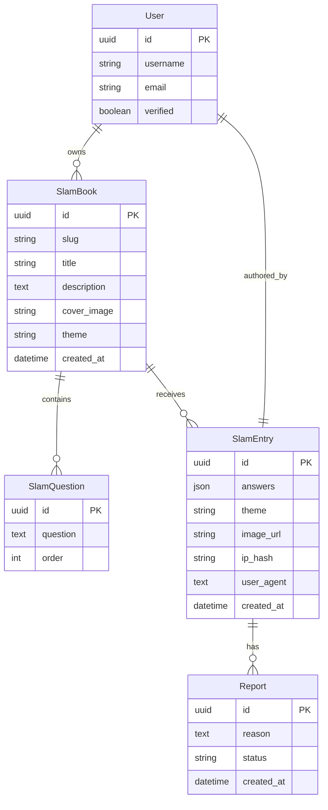

# Backend Documentation

## Overview
The backend is a **Django REST Framework** API that manages Slam Books, questions, entries, and reports. It uses standard Django models, serializers, and view classes.

## Data Model

## API Reference
| Method | URL | Description | Request Body | Response |
|--------|-----|-------------|--------------|----------|
| `GET` | `/slambooks/create/` | List Slam Books owned by the authenticated user | — | List of SlamBook objects |
| `POST` | `/slambooks/create/` | Create a new Slam Book | `{ "title": "...", "description": "...", "slug": "...", "theme": "...", "questions": [{"question": "...", "order": 0}] }` | Created SlamBook with generated `id` and `slug` |
| `GET` | `/slambooks/slug/<slug>/` | Retrieve a public Slam Book by its unique slug | — | SlamBook detail including questions |
| `PATCH` | `/slambooks/<id>/` | Update an existing Slam Book (owner only) | Partial fields as above | Updated SlamBook |
| `DELETE` | `/slambooks/<id>/` | Delete a Slam Book (owner only) | — | `204 No Content` |
| `POST` | `/entries/create/` | Submit an entry to a Slam Book (anonymous or logged‑in) | FormData with `slam_book`, `answers`, optional `cover_image`, `anonymous_name` | Created SlamEntry |
| `GET` | `/entries/<book_id>/` | List entries for a specific Slam Book | — | List of SlamEntry objects |
| `DELETE` | `/entries/<id>/` | Delete an entry (owner only) | — | `200 OK` |
| `POST` | `/pdf/generate/<book_id>/` | Trigger PDF generation (Celery task) | — | Task info with `download_url` |
| `POST` | `/reports/create/` | Report an entry for abuse | `{ "entry": "<entry_id>", "reason": "..." }` | Created Report |

## Important Notes
- `slug` is auto‑generated from the book title **and** the owner's username (see `models.save`).
- Anonymous submissions are rate‑limited by IP hash.
- PDF generation runs asynchronously via Celery.

---
*Generated by Antigravity*
