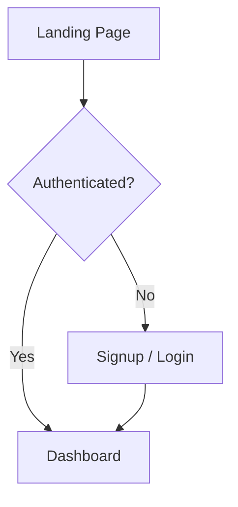

# Frontend Documentation

## Project Overview
The frontend is a **React** single‑page application built with **Vite** (or Create‑React‑App) and **React Router**. It consumes the Django REST API to create, view, and submit entries for Slam Books.

## Folder Structure
```
src/
├─ components/          # Re‑usable UI components (buttons, cards, etc.)
├─ pages/               # Page‑level components (Dashboard, SlamCreationPage, etc.)
├─ context/             # AuthContext – handles login/registration state
├─ services/            # Axios instance with base URL and auth interceptor
├─ App.jsx              # Root component with routing
└─ index.css            # Global styles (Tailwind‑like custom CSS)
```

## Key Pages & UI Flow
### 1. Landing → Signup / Login → Dashboard


### 2. Create Slam Book
```mermaid
flowchart TD
    C[Dashboard] --> E[Slam Creation Page]
    E --> F[Enter Title/Description/Theme]
    F --> G[Auto‑generate slug (title‑slug‑username)]
    G --> H[Submit → POST /slambooks/create]
    H --> I{Cover Image?}
    I -- Yes --> J[PATCH /slambooks/:id with cover_image]
    I -- No --> K[Redirect to Dashboard]
```

### 3. View & Submit Entry
```mermaid
flowchart TD
    C --> L[Slam Book Detail (slug URL)]
    L --> M[Display Questions]
    M --> N[Entry Form]
    N --> O[POST /entries/create]
    O --> P[Show success / update entry list]
```

## Important Components
| Component | Description | Key Props / State |
|-----------|-------------|-------------------|
| `SlamCreationPage.jsx` | Form for creating a new Slam Book. Handles slug generation, question list, optional cover upload. | `title`, `description`, `slug`, `questions`, `coverImage` |
| `Dashboard.jsx` | Lists user's Slam Books, provides navigation to creation page and delete actions. | `books` fetched from `/slambooks/create` |
| `SlamSubmissionPage.jsx` | Renders a public Slam Book (by slug) and its entry submission form. | `book` fetched by slug, `questions` array |
| `AuthContext.jsx` | Provides `user`, `login`, `register`, `logout` functions globally. | Stores JWT tokens in `localStorage` |

## API Interaction (Axios)
```js
// src/services/api.js
import axios from 'axios';

const api = axios.create({
  baseURL: import.meta.env.VITE_API_URL || 'http://localhost:8000/api',
});

// Attach auth token automatically
api.interceptors.request.use(config => {
  const token = localStorage.getItem('access_token');
  if (token) config.headers.Authorization = `Bearer ${token}`;
  return config;
});

export default api;
```

### Example: Create Slam Book
```js
const payload = {
  title,
  description,
  slug,
  theme,
  questions: questions.map(q => ({question: q.question, order: q.order})),
};
await api.post('/slambooks/create', payload);
```

### Example: Submit Entry (anonymous or logged‑in)
```js
const formData = new FormData();
formData.append('slam_book', bookId);
formData.append('answers', JSON.stringify(answers));
if (coverImage) formData.append('image_url', coverImage);
await api.post('/entries/create', formData, { headers: { 'Content-Type': 'multipart/form-data' } });
```

## UI/UX Notes
- **Slug Generation**: In the creation form, the slug field auto‑updates as the title changes (`handleTitleChange`). It is further ensured server‑side by the `save` method on `SlamBook` (title + owner username).
- **Theme Preview**: The `getThemePreview` function returns a dynamic CSS class to preview the selected scrapbook theme.
- **Error Handling**: Errors from the API surface are shown inline near the form (`setErr`).
- **Responsive Design**: Uses utility‑first Tailwind‑like classes for a mobile‑first layout.

---
*Generated by Antigravity*
